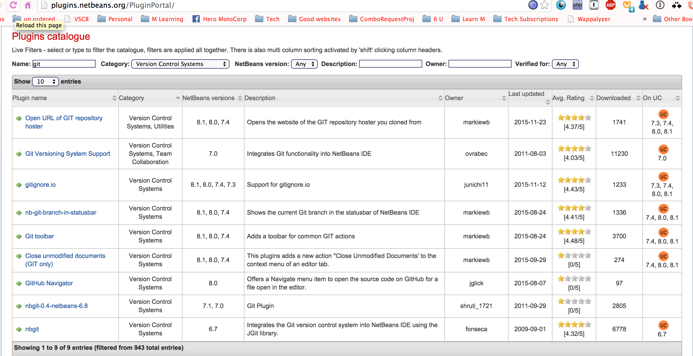

# integrations and plugins

Most of the Editors / IDE have plugins that work with Git

Here are some of them

1.[For Sublime Text (sublimegit)](https://sublimegit.net/)

2.[For Eclipse Ide (egit)](http://www.eclipse.org/egit/?gclid)

3.[For Notepad++](https://webdeveloperankitakulkarni.wordpress.com/2013/10/19/git-with-notepad/)

For Netbeans
http://plugins.netbeans.org/PluginPortal/

## Integration for Jenkin
[Git Plugin For Jenkin](https://wiki.jenkins-ci.org/display/JENKINS/Git+Plugin)

[The How To Trigger a Jenkins Job on a Git Push](http://fourword.fourkitchens.com/article/trigger-jenkins-builds-pushing-github)